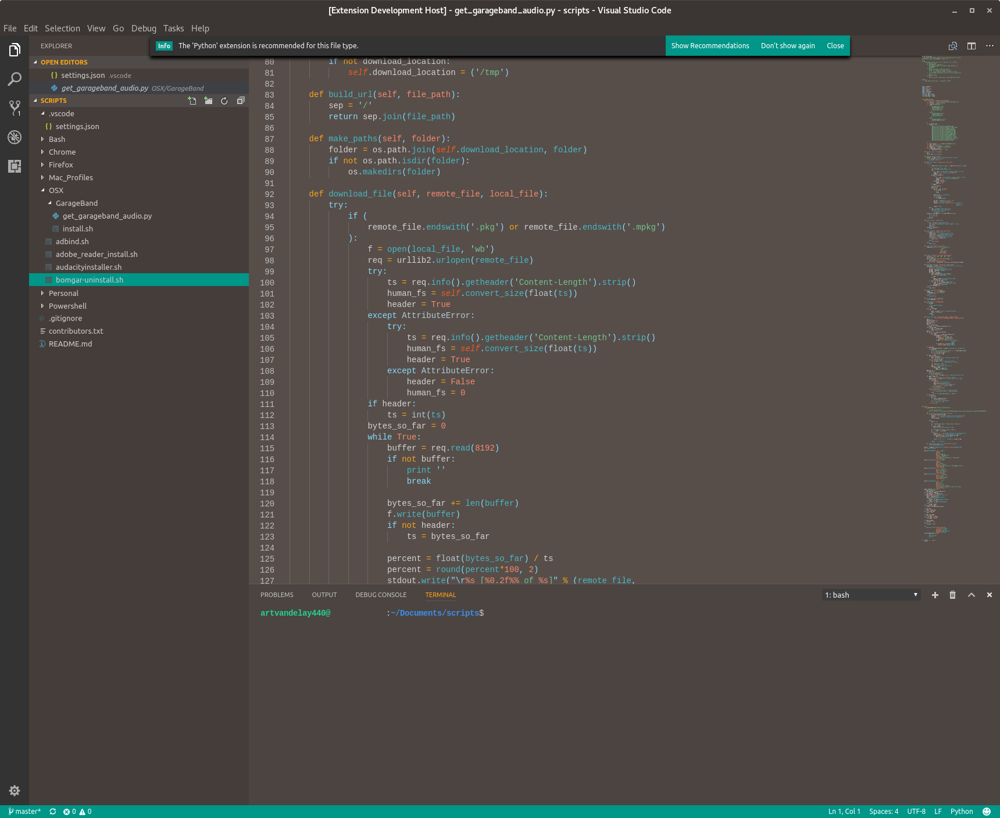

# Pop! Theme for VSCode

[](https://marketplace.visualstudio.com/items?itemName=ArtisanByteCrafter.poptheme) [](https://marketplace.visualstudio.com/items?itemName=ArtisanByteCrafter.poptheme) [](https://marketplace.visualstudio.com/items?itemName=ArtisanByteCrafter.poptheme) [](https://github.com/artvandelay440/VSCodePopTheme)

## Source and Inspiration
This theme is based on the design language created and maintained by [System76](https://system76.com/) for their [Pop!_OS](https://system76.com/pop) and themes. I am not affiliated in any way other than being a big fan.


## Screenshots



## Build and debug from source
It is possible to build and run this theme from source in a debugging context. This outline is for Ubuntu-based distributions.
Install Dependencies:
* Node.js 
    ````sh
    curl -sL https://deb.nodesource.com/setup_8.x | sudo -E bash -
    sudo apt install -y nodejs
    ````
* VSCode (via official repository)
    ````sh
    curl https://packages.microsoft.com/keys/microsoft.asc | gpg --dearmor > microsoft.gpg
    sudo mv microsoft.gpg /etc/apt/trusted.gpg.d/microsoft.gpg
    sudo sh -c 'echo "deb [arch=amd64] https://packages.microsoft.com/repos/vscode stable main" > /etc/apt/sources.list.d/vscode.list'
    sudo apt update
    sudo apt install code

Clone repository and open
````sh
git clone https://github.com/artvandelay440/VSCodePopTheme.git #clone into desired folder
code . #open VSCode at root of directory
````
Instantiate debugging session and choose Pop! Theme
* Debug > Start Debugging / F5
* A new VSCode window will open, then in the new instance, Hit `Ctrl + K, Ctrl + T` and choose `Pop Theme`

Please open any bugs or issues found as an official GitHub issue [here](https://github.com/artvandelay440/VSCodePopTheme/issues)

**Enjoy!**